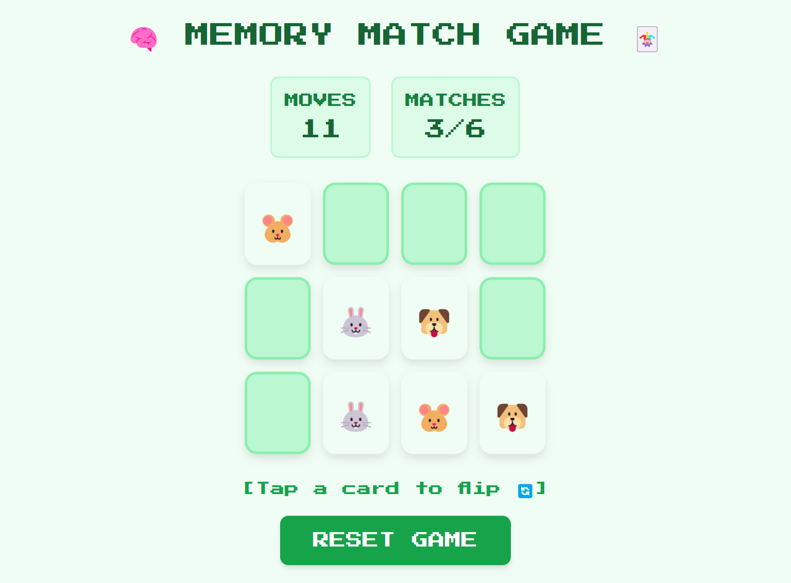

Code with emoji 😎💻

name: Memory Match

description: Flip cards to find matching pairs.

features:
- Card flipping
- Pair checking
- Win condition when all pairs matched

Demo: 

#html #html5 #webdevelopment #webdesign #frontend #coding #programming #tailwindcss #tailwind #css #webdesign #frontenddevelopment #responsive #uiux #webdev #javascript #js #webdevelopment #frontend #coding #programming #webdev #AI #AIDevelopment #MachineLearning #ArtificialIntelligence #DeepLearning 

